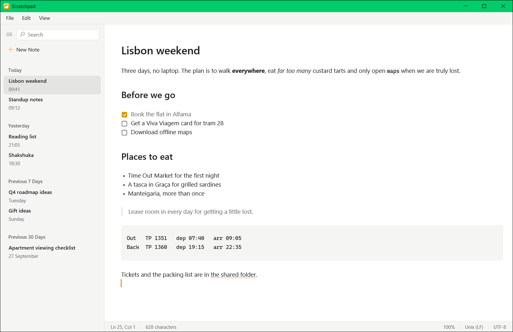
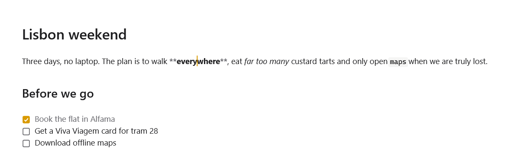
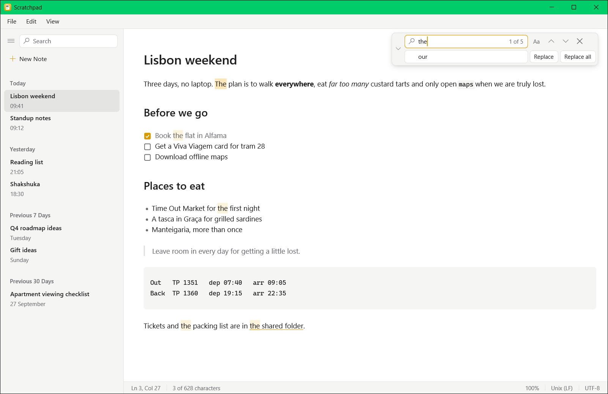
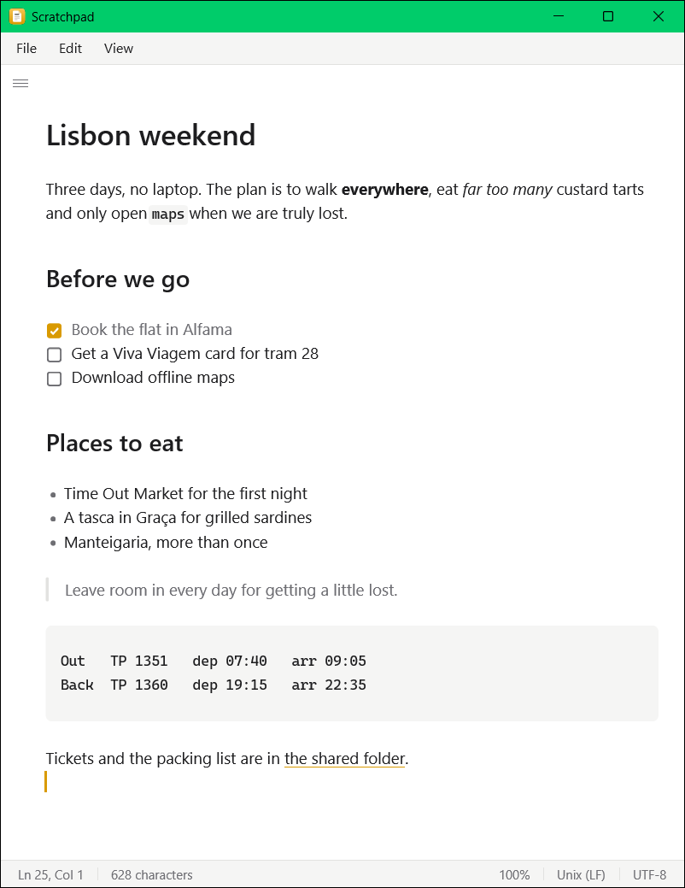

# Scratchpad

**A fast, native Notepad for Markdown notes.**

A Windows notes app for people who want Notepad's speed and simplicity, with Markdown that looks like Markdown while you type. Notes are plain `.md` files in a folder you own, saved as you write. It is written in Rust on [GPUI](https://www.gpui.rs/): one small native executable, no browser, no Electron, no account.

[Website](https://waterrmalann.github.io/scratchpad/)

<picture>
  <source media="(prefers-color-scheme: dark)" srcset="docs/landing/screenshots/hero-dark.png">
  
</picture>

## Features

**Writing**

- **Live preview** — Headings, bold, italic, strikethrough, inline code, code blocks, quotes, lists, task boxes, rules and links are drawn as you type. The Markdown markers show only where the cursor is. `Ctrl+/` shows all of them.
- **Markdown-aware editing** — Enter continues a list or quote, Tab nests a list item, `Ctrl+B`/`I`/`E`/`K` format the selection, and clicking a task box ticks it. `Ctrl`+click opens a link.
- **Plain text for other files** — Files that are not named `.md` or `.markdown` are edited as plain text, untouched by Markdown rules.

<picture>
  <source media="(prefers-color-scheme: dark)" srcset="docs/landing/screenshots/live-preview-dark.png">
  
</picture>

**Notes and files**

- **Plain files** — Every note is one `.md` file named after its first line. Sync it, put it in Git, edit it elsewhere.
- **Note list** — Newest first and grouped by date, with search over titles and contents (`Ctrl+P`). Rename in place, delete to the Recycle Bin after a confirmation.
- **Open anything** — `Ctrl+O` or `scratchpad.exe <file>` edits any text file in place. Save as writes a copy and carries on editing it.

**Saving and safety**

- **Autosave** — A note is saved shortly after you stop typing, by writing a temporary file and renaming it, so a crash never leaves half a note.
- **Crash recovery** — Unsaved text is snapshotted within half a second and offered back with Restore or Discard after a crash.
- **Other programs** — A note changed on disk while you have no edits is reloaded. If you have edits, you choose which version to keep, and the other one stays one Undo away.
- **Honest encodings** — A file's CRLF or LF line endings are kept. A file that is not valid UTF-8 opens read-only until you click Edit Anyway.

**Finding and view**

- **Find and replace** — In the open note, with match case, replace all and go to line.
- **Zoom and wrap** — Text size from 50 % to 400 % (`Ctrl+=`, `Ctrl+-`, `Ctrl`+wheel), word wrap on or off, a Notepad-style status bar with line, column, character count, zoom, line ending and encoding.
- **Themes and narrow windows** — System, Light or Dark. The note list collapses (`Ctrl+\`) and floats over the note in a narrow window.

<p>
  <picture>
    <source media="(prefers-color-scheme: dark)" srcset="docs/landing/screenshots/find-replace-dark.png">
    
  </picture>
  <picture>
    <source media="(prefers-color-scheme: dark)" srcset="docs/landing/screenshots/narrow-dark.png">
    
  </picture>
</p>

<details>
<summary><b>Keyboard shortcuts</b></summary>

The menu bar under the title bar has File (new note, open, save, save as, settings, exit), Edit (undo, redo, clipboard, delete, find, find next and previous, replace, go to line, select all) and View (zoom, and ticks for the status bar, word wrap, source mode and the sidebar). Each command shows its key. Alt+F, Alt+E, Alt+V or F10 open a menu from the keyboard.

The usual Windows editing keys work as in Notepad: arrows, Home/End, Ctrl+arrows, Shift to select, Ctrl+Backspace/Delete, Ctrl+Insert/Shift+Insert/Shift+Delete.

| Keys | Action |
| --- | --- |
| Ctrl+N | New note |
| Ctrl+S | Save now (notes also save themselves) |
| Ctrl+O | Open a file; files outside the notes folder are edited in place, `.txt` and other non-Markdown files as plain text |
| Ctrl+Shift+S | Save as another file and go on editing that one |
| Ctrl+Shift+F, Ctrl+P | Search notes |
| Ctrl+\ | Show or hide the note list (in a narrow window it floats over the note) |
| Ctrl+F | Find in the note; Enter / F3 next, Shift+Enter / Shift+F3 previous, Alt+C match case, Esc close |
| Ctrl+H | Replace in the note; Enter replace, Ctrl+Alt+Enter / Alt+A replace all, Tab next field |
| Ctrl+G | Go to line |
| Ctrl+Z / Ctrl+Y, Ctrl+Shift+Z | Undo / redo |
| Ctrl+B, Ctrl+I, Ctrl+Shift+X, Ctrl+E | Bold, italic, strikethrough, inline code (again at the end of the text: carry on unformatted) |
| Ctrl+K | Link |
| Enter / Shift+Enter | New line continuing the list or quote / plain new line |
| Tab / Shift+Tab | Nest a list item / move it out (elsewhere Tab inserts four spaces) |
| Ctrl+Shift+D, Alt+Up/Down | Duplicate lines, move lines |
| Ctrl+/ | Show all Markdown markers (View > Source mode) |
| Ctrl+= / Ctrl+-, Ctrl+wheel | Make the note's text larger / smaller (50% to 400%) |
| Ctrl+0 | Normal text size |
| Ctrl+click | Open a link |
| Up/Down, Enter, F2, Delete | In the note list: open the previous/next note, go to the note, rename, delete (asks first) |
| Ctrl+, | Settings |
| Ctrl+W, Ctrl+Q | Close the window, quit |
| Alt+F, Alt+E, Alt+V, F10 | Open the File, Edit or View menu (F10: File); arrows to move, Enter to choose, Esc to close |

</details>

## Where things live

- **Notes** — `Documents\Scratchpad`. Change the folder in Settings (`Ctrl+,`).
- **Settings** — Theme and notes folder, in `%APPDATA%\Scratchpad\config.json`. The window's size and place, zoom, word wrap, status bar, sidebar and last note are remembered there too.
- **Environment** — `SCRATCHPAD_NOTES_DIR` uses another notes folder (Settings then cannot change it) and `SCRATCHPAD_CONFIG_DIR` another folder for the config, recovery snapshots and log. Set both to try the app on a scratch folder.
- **Command line** — `scratchpad.exe <file>` opens that file, as File > Open does. The installer registers no file associations yet, so use "Open with" and pick `scratchpad.exe`.

## How it's built

```
scratchpad/
├─ crates/
│  ├─ scratchpad-editor/   # Rope buffer, cursor, undo, Markdown parsing, find. No GPUI.
│  ├─ scratchpad-core/     # Notes folder, atomic saves, search, config, recovery, watcher. No GPUI.
│  └─ scratchpad/          # The GPUI app: window, views, key bindings. Thin.
```

- The editor state lives in `scratchpad-editor`, which is tested headlessly with integration and property tests. The views only draw it.
- Offsets into the text are byte offsets in a rope; line endings are normalised to LF in memory and restored on save.
- The app is tested end to end with GPUI's headless test context: simulated keystrokes against a temporary notes folder, asserting on the files on disk.

## Build

There is no download yet, so build it yourself. Requires Windows 10/11, [Rust](https://www.rust-lang.org/tools/install) (MSVC toolchain) and the Windows SDK.

```powershell
git clone https://github.com/waterrmalann/scratchpad.git
cd scratchpad
cargo build --release -p scratchpad   # target/release/scratchpad.exe; slow: fat LTO over GPUI
```

## Run

```powershell
./target/release/scratchpad.exe   # release build
cargo run -p scratchpad           # debug build, logs to the console
```

To try it without touching your notes or settings, point it at scratch folders first:

```powershell
$env:SCRATCHPAD_NOTES_DIR = "$env:TEMP\scratchpad-try\notes"
$env:SCRATCHPAD_CONFIG_DIR = "$env:TEMP\scratchpad-try\config"
```

## Install

Build the per-user MSI (needs the .NET SDK too; WiX is restored as a repo-local tool):

```powershell
powershell -File packaging/build-installer.ps1   # -> target/installer/Scratchpad-<version>-x64.msi
```

It needs no administrator rights, installs to `%LOCALAPPDATA%\Programs\Scratchpad`, adds a Start Menu shortcut and an uninstall entry, and a newer MSI upgrades in place. Uninstalling leaves your notes and settings alone.

## Test

```powershell
cargo test --workspace
cargo clippy --workspace --all-targets -- -D warnings   # must be clean
cargo fmt --all --check                                 # must be clean
```

## Performance

Typing and scrolling take about 5 ms from input to paint in a 10 MB note. Startup is about 440 ms, almost all of it GPUI and the graphics driver. Budgets, numbers and how to measure them (`scripts/measure.ps1`) are in [docs/performance.md](docs/performance.md).

## Design decisions

Every significant decision is written down as an ADR, indexed in [docs/adrs/README.md](docs/adrs/README.md).

## License

MIT
